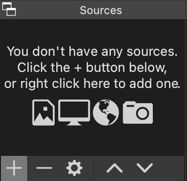
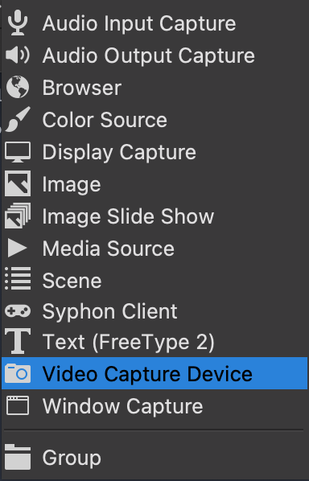
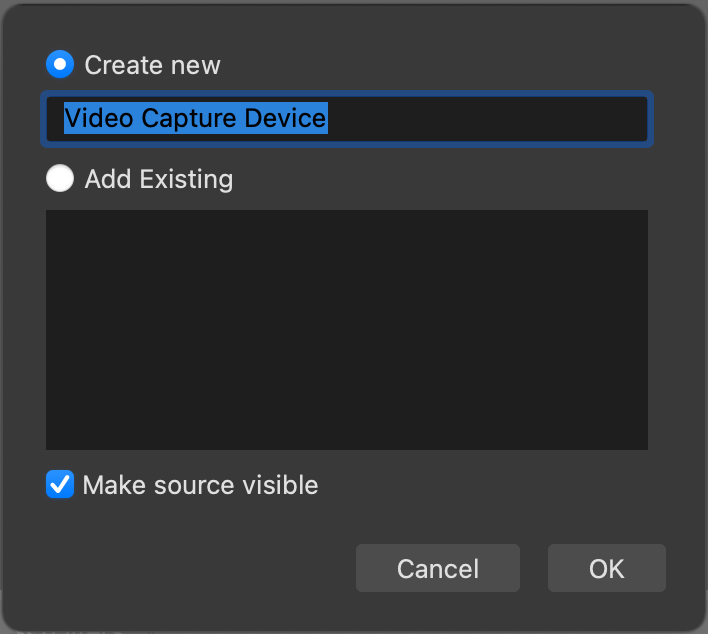
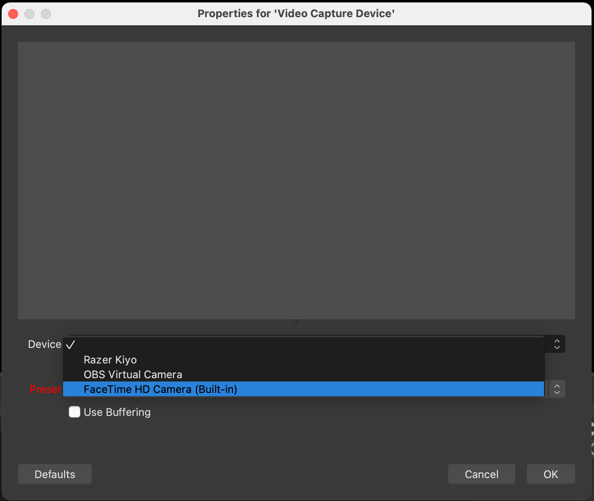
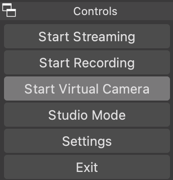
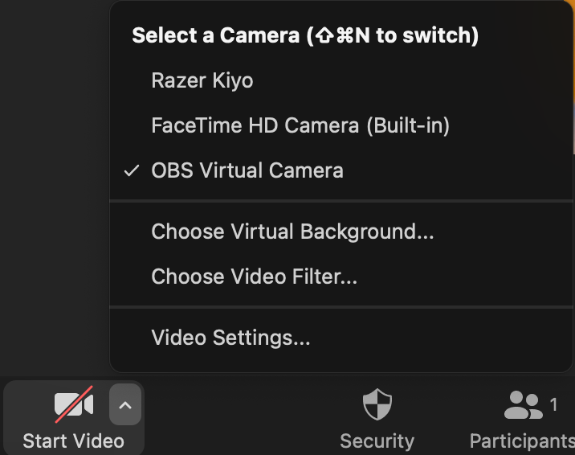
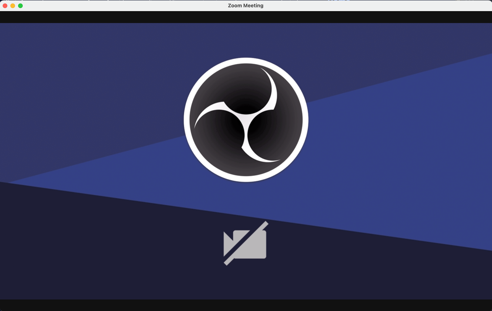

# Open Broadcaster Software

[Open Broadcaster Software (OBS)](https://obsproject.com/wiki/Home) is a free and open source software for video recording and live streaming. 

## Table of Contents

1. Quick Start  
2. FAQ  
3. Using OBS with Zoom  

## Quick Start

### Run the Auto-Configuration Wizard

1. From the [OBS Homepage](https://obsproject.com/), download your respective OBS software depending on the operating system that you currently have.

2. After downloading, when you run the program for the first time, you will be greeted by an Auto-Configuration Wizard which will help you get started as quickly as possible. The wizard will automatically test your system and attempt to find settings that your PC can handle. This includes streaming or recording, resolution, bitrate, encoder, streaming provider and more. You are free to change the settings afterwards to suit your needs better.

3. If you only see the main OBS Studio window, you can open the Auto-Configuration Wizard in the Tools menu at the top. 

### Set up Audio Devices

1. Next will be setting up your audio devices. By default, OBS will capture your system default desktop audio device and microphone. You can verify this by looking at the volume meters in the mixer section of the main OBS Studio window, and see if they are active. If they aren't moving, or you suspect the wrong device is being captured, click on Settings -> Audio and select the devices manually.

**MacOS Users:** If you are using macOS, you will need a seperate application to capture desktop audio. This is due to the limitations in macOS that provide no direct capture methods for desktop audio devices.

### Adding Sources for Video

1. Next you will be greeted by a preview of a black screen. OBS does not capture any video by default. To get started capturing, **you need to add a Source**. 

2. At the bottom of the window is a box called 'Sources'. Click on the + (or right click inside the box) and pick the source you want. A few examples of sources include Game capture if you are capturing a game, Window for non-game applications, or Video Capture Device for a webcam or capture card.

Sources and Scenes are the bread na butter of OBS Studio, and can be incredibly powerful.

### Testing Stream and Record Settings

1. Double check that all your settings are how you want them in Settings -> Output. 
2. **Hit Start Recording or Start Streaming**. 
3. We strongly encourage running a test for a few minutes to make sure that there are no issues, rather than just jumping in to your first stream or recording. 
4. If you run into any issues, or need further help, please take a look into our FAQ section.

## FAQ
 
1. Where are my recordings saved?

Once your recording is done, you can find it using File -> Show Recordings. You can change this in File -> Settings -> Output -> Recording.

2. I need my recordings in MP4.

File -> Remux Recordings will quickly and easily convert your video files into MP4.

3. My video is laggy.

Depending on the kind of lag, this could be related to a slow internet connection, using too many hardware resources, or using the incorrect settings. Read the troubleshooting guides linked below for more help.

## Using OBS with Zoom

1. Ensure you have the latest version of OBS and Zoom installed.

2. If this is your first time installing or using either of these together, completely restart your computer so the correct options will show up on the software.

3. On the bottom left of the OBS Studio window, click on the + and select 'Video Capture Device'. You will be prompted to create a new Video Capture Device. Select OK.

4. Next you will need to select the correct device on which you will stream your video. This will either be your built in camera, or if you have an external camera, select that device and ensure it is working correctly by viewing your video preview. Then select OK.

5. On the bottom right of the OBS Studio window, you will see a list of options which include **Start Virtual Camera**. Click this option to begin mirroring your OBS video to Zoom.

6. On the bottom left of the Zoom window, you will see your audio and video buttons. Click on the little arrow on video to display a list of available video sources and select OBS Virtual Camera. You have now successfully connected OBS to Zoom. If you turn your video off on Zoom, your screen should show an OBS preview image.

